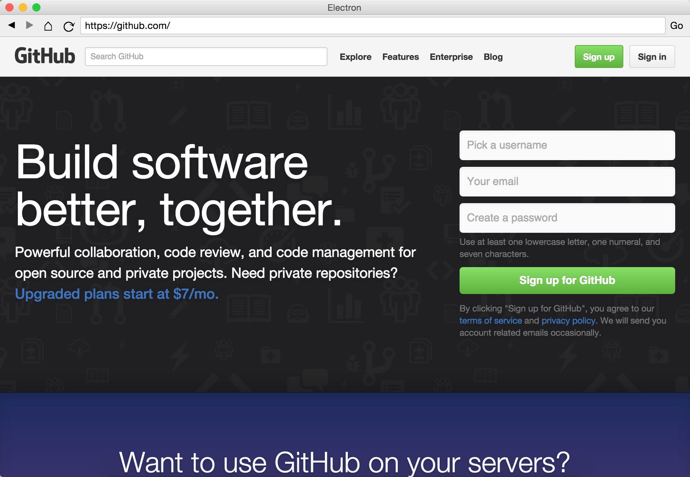

# ElectroWeb   
 
An electron based web browser.

## Table of contents
1. [Supported Devices](#supported-devices)
2. [How to Install](#how-to-install)
3. [Lunix Install](#lunix-install)
4. [Packages](#packages)
5. [Other ways to Install](#other-ways-to-install)
6. [Build from code](#build-from-code)
7. [Screenshot](#screenshot)
8. [Help](#help)
9. [Coming soon](#coming-soon)

### Supported Devices:
1. macOS (Coming soon)
2. Windows 10 
3. Lunix (Most distros) (Coming soon)
4. Windows Server 
- PLEASE NOTE THE IOS AND ANDROID BUILDS WILL NOT BE BUILD WITH ELECTRON DEW TO LACK OF SUPPORT FOR MOBLE.
5. IOS (Coming soon)
6. Android (Coming soon)

### How to Install
1. Download the package for you OS.
2. Follow installer from there.

### Lunix Install
1. Download the correct file from the link below for you lunix distro
2. If on ubuntu or debian, open downloaded file by clicking on it twice, this should open the package manager, hit install.
3. For more help open an issue or look up more help, open issues that have be solved will be closed and if needed add to documentery.

### Packages
- macOS:
- Windows: [Download Link](https://fileftp1-cssudii.web.app/ElectroWeb-Setup.exe)
- Lunix:
- IOS:
- Android:

### Other ways to install.
1. Build from code.

#### Build from code
0. Open terminal or git shell
1. Install NPM and git on lunix, windows, or macOS.
2. Install electron: link to install.
3. Clone this repostery.
4. cd to the folder you just cloned.
5. run npm install.
6. run npm start.
7. Wait untill the app opens.

### Screenshot

### Help

Help info is coming soon

### Coming soon!
- Support for multiable tabs
