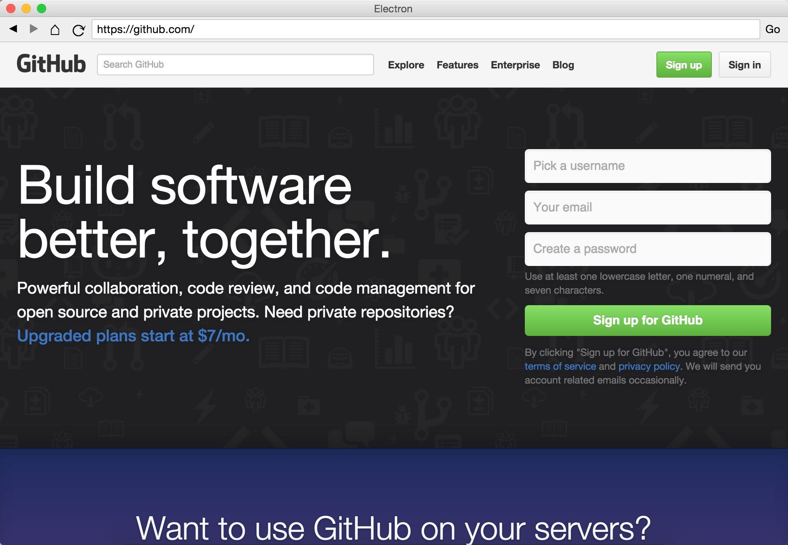

# ElectroWeb   
 
An election based web browser.

### Supported Devices:
1. macOS (Coming soon)
2. Windows 10 (Coming soon)
3. Lunix (Most distros) (Coming soon)
4. Windows Server (Coming soon)
5. IOS (Coming soon)
6. Android (Coming soon)

### How to Install
1. Download the package for you OS.
2. Follow installer from there.

### Packages
- macOS:
- Windows:
- Lunix:
- IOS:
- Android:

## Screenshot

 
